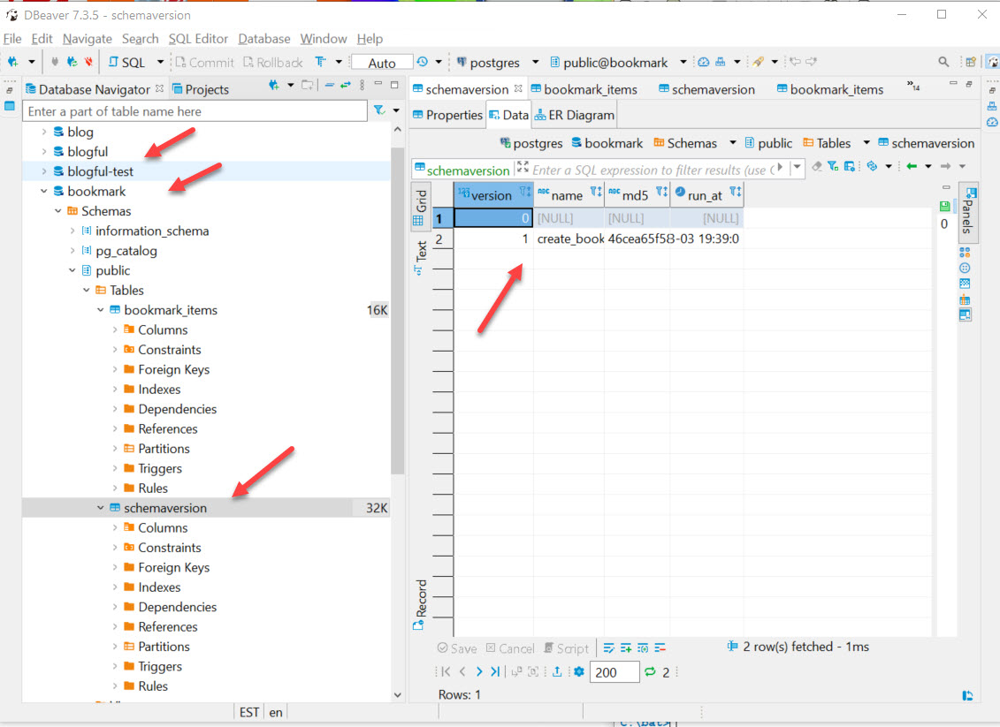

## >> Project Name:

Bookmarks-Server-2--Express-Server-Postgres--assignment

## >> Project Summary:

This assignment further refactors previous [Bookmarks Server API project](https://github.com/davetam88/Bookmarks-Server--Express-Server-assignment) to support data persistence for the bookmark API server APP with the use of PostgreSQL database engine(in place of the in-memory storage);  GET, POSTed and DELETEd APIs were fully implemented with endpoint and endpoint routings.

Express routing API was used to construct the endpoint code to make the code modularize and easy to maintain.

CRUD service (Create, Read,  Update and  Delete) was implemented via a set of methods in a single service file.

Integrated test was developed in tandem with API code development by using Mocha(a testing framework), Chai(an assertion library), and Supertest(a tool for testing HTTP calls) to ensure maximum code reliability.

## >> Database

Database bookmark and bookmark-test were used and bookmark_items is the database table.

## >> Suported end points

```
> GET /bookmarks = to read all the bookmarks
> POST /bookmarks = to create a new bookmark
> GET /bookmarks/:bookmark_id = to read an individual bookmark
> DELETE /bookmarks/:bookmark_id = to delete an individual bookmark
```


## >> Screenshots

Use of Postgrator's Migrations technique to manage the creation of tables, relations, and rollback, etc.



# Express Boilerplate! 

This is a boilerplate project used for starting new projects!
`
## Set up 

Complete the following steps to start a new project (NEW-PROJECT-NAME):

1. Clone thisa repository to your local machine 
   git clone BOILERPLATE-URL NEW-PROJECTS-NAME
2. `cd` into the cloned repository
3. Make a fresh start of the git history for this project with 
   rm -rf .git && git init
4. Install the node dependencies 
   npm install
5. Move the example Environment file to `.env` that will be ignored by git and read by the express server 
   mv example.env .env
6. Edit the contents of the `package.json` to use NEW-PROJECT-NAME instead of `"name": "express-boilerplate",`

## Scripts

Start the application 
  npm start

Start nodemon for the application 
  npm run dev

Run the tests 
  npm test

## Deploying

When your new project is ready for deployment, add a new Heroku application with 
  heroku create
This will make a new git remote called "heroku" and you can then 
  npm run deploy
which will push to this remote's main branch.

